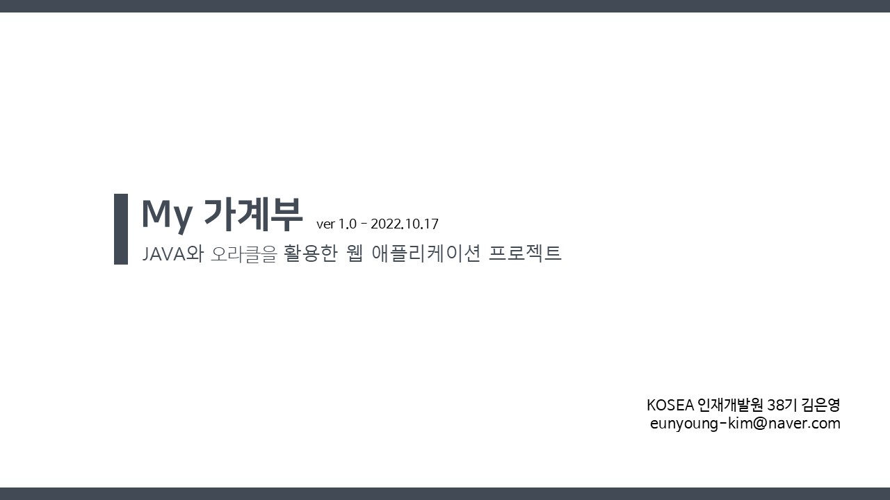
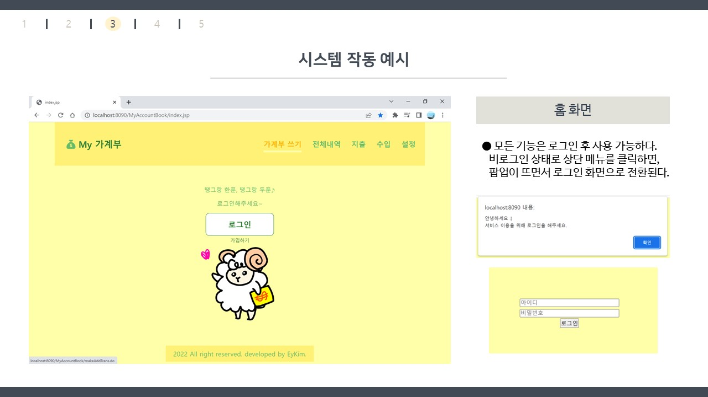
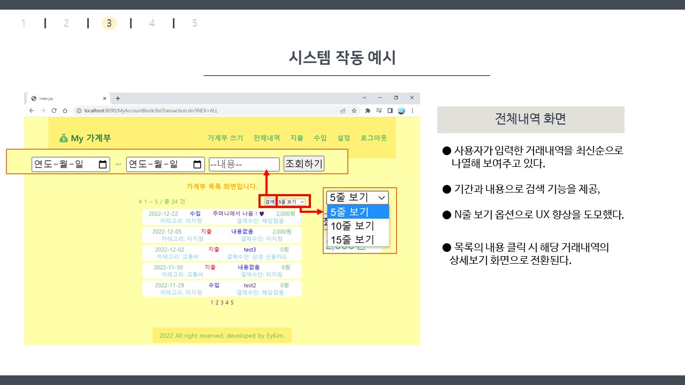

# My 가계부 1
### 💰 Java와 Servlet으로 만들어보는 나만의 가계부 어플리케이션
- 국비지원 학원에서 Java Servlet까지 배운 뒤 정보처리산업기사 과정평가형 실기 과제로 제출한 프로젝트이다.
- DB 설계와 기본적인 CRUD구현까지가 과제의 요구 사항이였으나, 그에 그치지 않고 javascript로 실제 가계부 어플리케이션으로서 필요한 기능을 면밀히 구현하고자 노력했다.
- 이후 **Servlet (v.1)
→ [Spring (v.2)](https://github.com/EyEmilyKim/MyPrj_MyAccountBook2_spring)
→ [Spring Boot (v.3)](https://github.com/EyEmilyKim/MyPrj_MyAccountBook3_springBoot/tree/main)
로 고도화**하여 개인 프로젝트로 이어나갔다.
  
## 📅 개발 기간
- **핵심 개발** : 2022.10.06 ~ 2022.10.16 (10일)

## 🛠️ 기술 스택
- **Front** : JSP, JSTL / Javascript
- **Back** : Java 8 / Servlet / Oracle

## 💝 프로젝트 소개서

## 📝 **개발자 노트**
- 그 밖의 관련 정보는 [개발자 블로그](https://blog.naver.com/bunn_ey_run_ey/222903715938)에서 확인할 수 있습니다.
